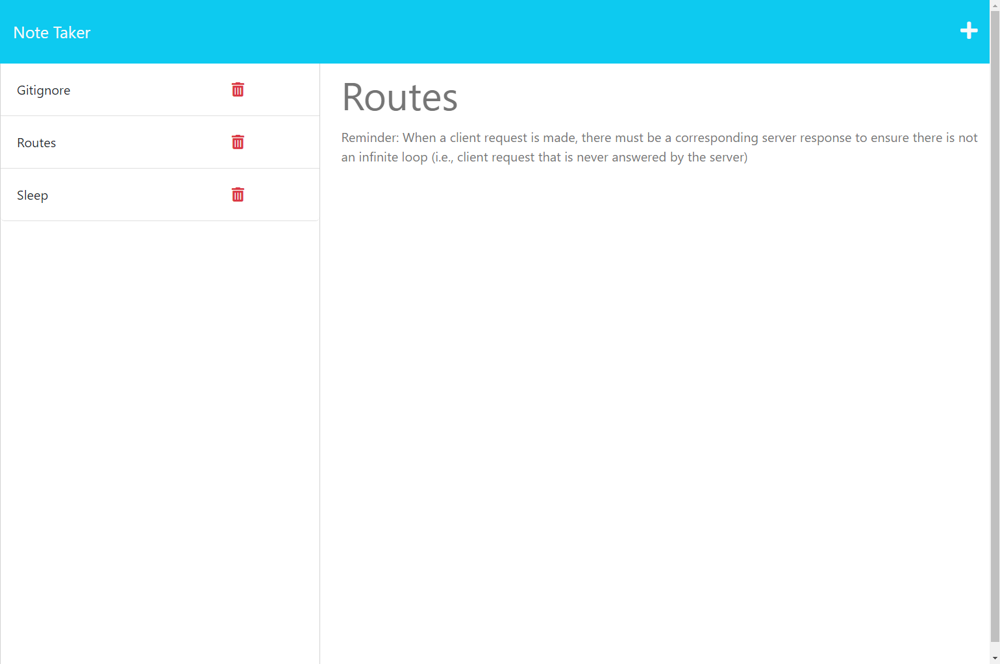

# Express Note Taker

## Description

[Click this link to access the website](https://greg-pfeifer.github.io/weather_dash/)

This project was completed for the purpose of setting up the back-end of a web application that facilitates note-taking. The user can enter a note that is then stored and can be accessed. 

## Usage

Screenshots of deployed application

## License

Please refer to the repository to find a copy of the license.